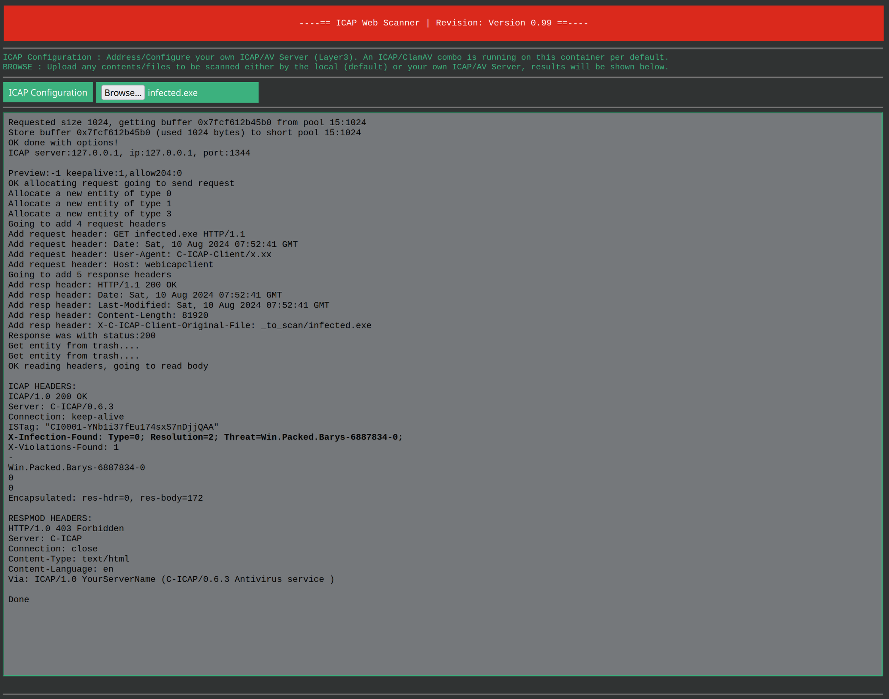
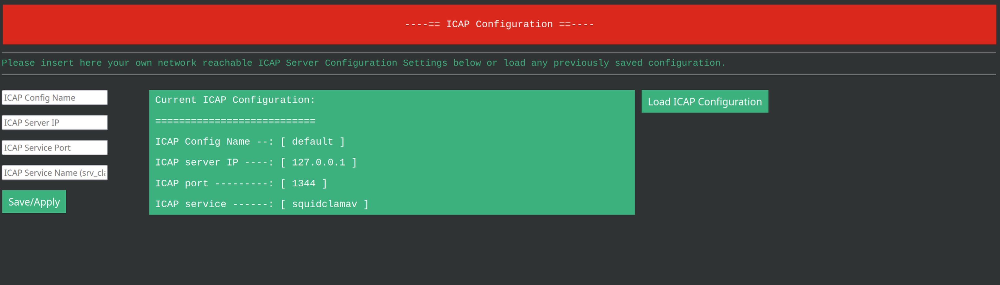

# Web ICAP Scan

## Building a Docker Container with locally setup ```c-icap``` & ```ClamAV``` server addressable through a Web Based Front-End.

The idea of this project is to create a Docker Container which will let you instantly scan any wanted contents from a Web Based Front-End:   

- [c-icap server](https://github.com/c-icap/c-icap-server) acting as our ICAP content adaptation service.
- [ClamAV](https://github.com/Cisco-Talos/clamav) as our backend AntiVirus scanning engine upon ICAP submissions.
- The [ClamAV official signatures databases](https://lists.clamav.net/pipermail/clamav-virusdb/).
- [SquidClamAV](https://squidclamav.darold.net/) as our local ICAP service.
- 3rd party unofficial ClamAV signatures databases enhancing our detection capabilities.
- Network reachable 3rd party ICAP/AV Server can be addressed (currently in clear text).

## Targeted physical environment --> Docker Host available for a new container:
````
 - ClamAV is setup through the Alpine repo.
 - c-icap / c-icap-client are compiled at container creation.

         +-----------------------------------------------------+                                                     
         |  webicapscan alpine docker container                |                                                     
         |                                                     |                                                     
         |                                 +-----------------+ |                                                     
         |                                 | ClamAV          | |                                                     
         |                                 | ClamD           | |                                                     
         | +-------------+                 +-----------------+ |                                                     
         | | freshclam   |                 | c-icap          | |                                                     
         | | signatures  |                 | 127.0.0.1:1344  | |                                                     
         | | updates     |                 |                 | |                                                     
         | +-------------+                 +-----------------+ |                                                     
         +-----------------------------------------------------+                                                     
                              | ||| |eth0                                            
                              +-----+tcp:5000                                                     
                                 |
                                 |
                             0.0.0.0/0
````

The aims of ```webicapscan``` are:

- Provide a Web front-end in order to AV scan contents on the fly.
- Provide a local combo of ClamAV/ClamD/SquidClamAV/c-icap/c-icap-client, hence letting you conduct scans locally from the Web front-ned.
- Provide a possibility to address other/further ICAP Servers possibly present on your network.

**A few notes before you start:**
- The ```ConcurrentDatabaseReload yes``` parameter which is set within [```/etc/clamav/clamd.conf```](https://github.com/obuno/webicapscan/blob/main/etc/clamav/clamd.conf) will require you to have enough free system resources (2x operational used memory, 4GB shall be enough) in order to temporarily load a second ClamAV scanning engine while scanning continues using the first engine. Once fully loaded, the new engine takes over while the previous goes to heaven.
- ```freshclam``` is scheduled to run at boot time and hourly, thus downloading/updating all the [```/etc/clamav/freshclam.conf```](https://github.com/obuno/webicapscan/blob/main/etc/clamav/freshclam.conf) configured ClamAV & 3rd parties Databases.
- You will need a dedicated directory on your Docker Host in order to host the to be downloaded/updated ClamAV Databases through a Docker Container volume.
- You're able to address the ```squidclamav``` ICAP service on 127.0.0.1:1344 from the Web front-end per default.
- The used Web Server is a development server which is not recommended for production deployment.
- Currently, pip/pip requirements are setup using ```--break-system-packages``` / .venv would be cleaner.   

The main page from the Web frontend, provided through a python/flask application:   
  

The ICAP configuration page (letting you address different ICAP enabled systems):   
  

## Deploying the webicapscan container in your environment: 

### Create a directory and switch to it:

```
mkdir -p /local/github
cd /local/github
```

### Cloning the repository and switch to it:

```
git clone https://github.com/obuno/webicapscan
cd webicapscan
```

### Build and run the image:

**You can use the included [newborn_webicapscan.sh](https://github.com/obuno/webicapscan/blob/main/newborn_webicapscan.sh) shell script to deploy/compile everything needed at once. You will need to adapt and update that file in regards to your own environment (IP addresses/bound port/container volume configuration etc.) before running it.**  

The needed specific information's resides in line #13 of the [newborn_webicapscan.sh](https://github.com/obuno/webicapscan/blob/main/newborn_webicapscan.sh) file:   

```
doker container create --name webicapscan -p [docker-host-ip]:5000:5000 --dns [local-or-public-dns-server-ip] -v [/path/to/the/clamav/databases]:/var/lib/clamav -it webicapscan:latest
```

Settings                      | Explanation
----------------------------- | -------------
docker-host-ip                | on which Docker Host present IP address you'll want to expose your container.
local-or-public-dns-server-ip | A working DNS server IP address, either local or over The Internet.
/path/to/the/clamav/databases | A directory on your Docker Host where the ClamAV & 3rd parties Databases will be downloaded to initially at container first boot as well as updated hourly.

Providing the Docker Host directory for your webicapscan container volume will assure that you can destroy the webicapscan container while keeping all the downloaded databases in the occurrence of a new/fresh webicapscan container deployment.   

Once these above information's have been updated, you can run the script with: 

```
bash newborn_webicapscan.sh
```

### Testing your setup:

- the webicapscan web interface is listening on port :5000 per default --> http://[docker-host-ip]:5000
- You can test your setup using known bad samples or the provided [eicar.zip](https://github.com/obuno/webicapscan/blob/main/av-samples/eicar.zip) file.

## Unofficial ClamAV provided Signatures (through freshclam):

- [SaneSecurity](https://sanesecurity.org/usage/signatures/)
- [R-fx Networks - Linux Malware Detect](https://www.rfxn.com/tag/malware/)
- [Ditekshen](https://github.com/ditekshen/detection)
- [InterServer's InterShield](http://rbl.interserver.net/)
- [URLhaus ClamAV signatures](https://urlhaus.abuse.ch/api/#clamav)

## Recommended ClamAV add-ons:

I would highly recommend you to add/test the following unofficial ClamAV databases to your locally available ClamAV DB's:

- The SecuriteInfo ClamAV databases in "Pro Subscription": https://www.securiteinfo.com/clamav-antivirus/improve-detection-rate-of-zero-day-malwares-for-clamav.shtml?lg=en

## Troubleshooting:

- the container ready to serve time can take a few minutes minutes, all the ClamAV databases are downloaded/updated/loaded in memory at boot time -- just be patient.
- should you think that some signatures might trigger on false positive, you're able to [whitelist them](https://www.securiteinfo.com/clamav-antivirus/whitelisting-clamav-signatures.shtml).

## To Do/To Fix:

- [ ] c-icap -- run as non-root user (currently root).
- [ ] python/pip -- implement .venv
- [x] squidclamav -- implement SquidClamAV as an ICAP service -- DONE 11.08.2024
- [x] webicapscan.py -- provide a fallback to the default ```localhost``` ICAP configuration -- DONE 15.08.2024
- [ ] webicapscan.py -- run as non-root user (currently root).
- [ ] webicapscan.py -- enable SSL/TLS remote ICAP servers (currently possible using clear text submissions).
- [ ] webicapscan.py -- flask app would benefit from python knowledgeable people / working but perhaps messy and dirty.